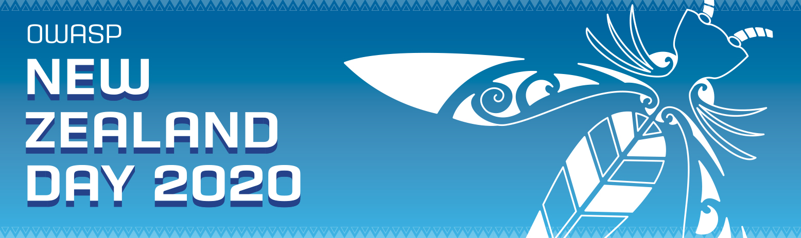

---

layout: col-sidebar
title: OWASP New Zealand
tags: owaspnz
currency: nzd

region: Oceania

---

## OWASP New Zealand

Welcome to the OWASP New Zealand Chapter home page.

The OWASP New Zealand Chapter has been active since 2007. In addition to our annual [OWASP New Zealand Day](https://www.owasp.org/index.php/OWASP_New_Zealand_Day_2020) conference, we organise local Meetups and training events throughout the year.

The chapter leaders are [Kim Carter](mailto:kim.carter@owasp.org) (Christchurch), [Kirk Jackson](mailto:kirk.jackson@owasp.org)
(Wellington), and [John DiLeo](mailto:john.dileo@owasp.org) (Auckland).

## Upcoming Events

### Local Meetup Links

* [OWASP New Zealand Chapter-Auckland](https://www.meetup.com/OWASP-New-Zealand-Chapter-Auckland/) 
* [OWASP New Zealand Chapter-Christchurch](https://www.meetup.com/OWASP-New-Zealand-Chapter-Christchurch/) 
* [OWASP New Zealand Chapter-Wellington](https://www.meetup.com/OWASP-Wellington/)
---

**19 - 21 February 2020**

**[OWASP New Zealand Day 2020](https://wiki.owasp.org/index.php/OWASP_New_Zealand_Day_2020)** - University of Auckland School of Business
* One-day conference, with three tracks, on Friday, 21 February - [Conference Registration](https://owaspnz2020.eventbrite.com) is FREE
* Pre-Conference Training, Wednesday and Thursday, 19-20 February - Nine classes on offer  
[Training Registration](https://owaspnz2020-training.eventbrite.com) closes 12 February  
Registration fees: $325.00 for half-day classes; $625.00 for one-day classes; $1250.00 for two-day classes (plus EventBrite fees)
---

**10 February 2020**

[Wellington Meetup](https://www.meetup.com/OWASP-Wellington/events/268151993/) 

**Presentation:** Introduction to the OWASP Top Ten - Kirk Jackson  
**When:** Monday, 10 February; Gather at 5:30 p.m.; Talk starts at 6:00 p.m.  
**Location:** RedShield House, 79 Boulcott St., Wellington  
**YouTube Live Stream:** (https://www.youtube.com/watch?v=bZgjUXAjNao)
---

### Keeping in Touch

  - Chapter Mailing List (Google Groups):
    [New-Zealand-Chapter@owasp.org](mailto:new-zealand-chapter@owasp.org)
    - [Join the
    Group](https://groups.google.com/a/owasp.org/forum/#!forum/new-zealand-chapter/join)
  - [InfoSecNZ Workspace](https://infosecnz.slack.com) on Slack - Be
    sure to join the \#events channel for calendar notices (NOTE: By
    design, we do not maintain a separate Slack Workspace for the New
    Zealand chapter)
  - Follow us on [Twitter](https://www.twitter.com/owaspnz) (@owaspnz)

### Some Global OWASP Resources:

  - [Directory of OWASP's Google
    Groups](https://groups.google.com/a/owasp.org/forum/?hl=en#!forumsearch/)
  - [OWASP Workspace](https://owasp.slack.com) on Slack

### Call For Speakers

Our Call For Speakers is always open. If you would like to present a talk relevant to Application Security at a future OWASP New Zealand Chapter Meetup, review the [speaker agreement](/www-policy/speaker-agreement) and send your proposed talk title, abstract, and a brief speaker bio to the Chapter Leader(s) in the city(ies) where you'd like to present.

### Call for Organisers

OWASP New Zealand currently has active Meetups in three cities - Auckland, Christchurch, and Wellington. If you're interested in helping organise one of our Meetups, please contact the Chapter Leader in that city.

If you are located in another New Zealand city, and would be willing and able to host a Meetup there (at least four times per year), then we'd love to hear from you.

### The OWASP New Zealand Board

We are always looking for additional board members to evangelise OWASP and its mission, and to help with meetings, projects, and initiatives. As we all know, it takes lots of time and effort to run a chapter. Please contact us if you are interested in joining the OWASP New Zealand board, would like to volunteer to help out or create a new Meetup/event, or for any queries related to the OWASP New Zealand Chapter.

## OWASP Statement on Participation

The Open Web Application Security Project (OWASP) - managed by the non-profit OWASP Foundation - works to improve the security of software. All of our projects, tools, documents, forums, and chapters are free and open to anyone interested in improving application security. 

Chapters are led by local leaders in accordance with the [Chapter Leader Handbook](/www-policy/rules-of-procedure/chapter-handbook). Financial contributions should only be made online using the authorised online donation button. To be a SPEAKER at ANY OWASP Chapter in the world simply review the [speaker agreement](/www-policy/speaker-agreement) and then contact the local chapter leader with details of what OWASP Project, independent research, or related software security topic you would like to present.

Everyone is welcome and encouraged to participate in our [Projects](/projects), [Local Chapters](/chapters), [Events](/events), [Online Groups](https://groups.google.com/a/owasp.com/){:target='_blank'}, and [Community Slack Workspace](https://owasp.slack.com/){:target='_blank'}. We especially encourage diversity in all our initiatives. OWASP is a fantastic place to learn about application security, to network, and even to build your reputation as an expert. We also encourage you to be [become a member](/membership) or consider a [donation](/donate) to support our ongoing work.
