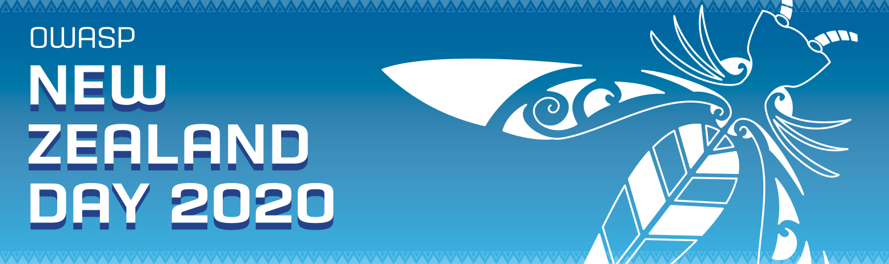

## Past Events

### 2024

#### Saturday, 15 June: [OWASP Training Day-Auckland](https://events.humanitix.com/owasp-training-day-auckland-jun-2024) 

**Classes Offered:** 

* Assess and Improve Your AppSec Program using OWASP SAMM - John DiLeo
* Like ISO/IEC 27001, but Backwards - Stephen Coates

**Location:** 2Degrees Head Office (Level 2/136 Fanshawe Street, Auckland)   
**Time:** 8:45 a.m. - 5:30 p.m.    

-------------

#### Tuesday, 21 May: [Auckland Meetup](https://www.meetup.com/owasp-new-zealand-chapter-auckland/events/297780385/) 

**Top Ten Topic:** A02:2021 - Cryptographic Failures - John DiLeo ([@gr4ybeard](https://twitter.com/gr4ybeard))   
**Technical Presentation:** Listeners' Choice      
**Location:** The Corner Store (25 Mount Eden Road)   
**Time:** 6:30 p.m.    

-------------

#### Tuesday, 12 March: [Auckland Meetup](https://www.meetup.com/owasp-new-zealand-chapter-auckland/events/297780380/) 

**Top Ten Topic:** A01:2021 - Broken Access Control - John DiLeo ([@gr4ybeard](https://twitter.com/gr4ybeard))   
**Technical Presentation:** OWASP SAMM - Overview and Update      
**Location:** The Corner Store (25 Mount Eden Road)   
**Time:** 6:30 p.m.    

-------------

#### Saturday, 27 January: [OWASP Training Day-Hamilton](https://events.humanitix.com/owasp-training-day-hamilton-jan-2024) 

**Classes Offered:** 

* Threat Modelling: From none to done - John DiLeo
* Like ISO/IEC 27001, but Backwards - Stephen Coates

**Location:** Gallagher World Headquarters (181 Kahikatea Drive, Hamilton)   
**Time:** 8:45 a.m. - 5:30 p.m.    

-------------

### 2023

#### 21 November: [Auckland Meetup](https://www.meetup.com/owasp-new-zealand-chapter-auckland/events/291721034/) 

**Top Ten Topic:** A10:2021 - Server-Side Request Forgery (SSRF) - John DiLeo ([@gr4ybeard](https://twitter.com/gr4ybeard))   
**Technical Presentation:** Creating Test Cases for Security Features - John DiLeo, IriusRisk      
**Location:** The Corner Store (25 Mount Eden Road)   
**Time:** 6:30 p.m.    

-------------

#### Saturday, 11 November: [OWASP Training Day-Dunedin](https://events.humanitix.com/2023-owasp-training-day-dunedin) 

**Class Offered:** Threat Modelling: From none to done - John DiLeo      
**Location:** MTF Finance National Office (Level 1/98 Great King Street)   
**Time:** 8:45 a.m. - 5:30 p.m.    

-------------

#### 13 September: [Auckland Meetup](https://www.meetup.com/owasp-new-zealand-chapter-auckland/events/291721023/) 

**Top Ten Topic:** A09:2021 - Security Logging and Monitoring Failures - John DiLeo   
**Technical Presentation:** Listeners' Choice - John DiLeo      
**Location:** B:HIVE (72 Taharoto Road, Takapuna)   
**Time:** 6:30 p.m.    

-------------

#### 11 July: [Auckland Meetup](https://www.meetup.com/owasp-new-zealand-chapter-auckland/events/291721004/) 

**Top Ten Topic:** A08:2021 - Software and Data Integrity Failures - John DiLeo   
**Discussion:** Retrospective on OWASP New Zealand Day 2023      
**Location:** Jubilee Building (545 Parnell Road)   
**Time:** 6:30 p.m.    

-------------

#### Tuesday-Friday, 4-7 July: Thirteenth OWASP New Zealand Day

**[OWASP New Zealand Day 2023](https://appsec.org.nz/conference-2023/)** - Auckland University of Technology (AUT) City Campus   
* Two-day conference, with two tracks, on Thursday and Friday, 6-7 July   
* Pre-Conference Training, Tuesday and Wednesday, 4-5 July - Six (6) classes presented      

-------------

#### 9 May: [Auckland Meetup](https://www.meetup.com/owasp-new-zealand-chapter-auckland/events/291720878/) 

**Top Ten Topic:** A07:2021 - Identification and Authentication Failures - John DiLeo ([@gr4ybeard](https://twitter.com/gr4ybeard))   
**Technical Presentation:** Let's Talk about Threat Modelling - John DiLeo, IriusRisk      
**Location:** B:HIVE (72 Taharoto Road, Takapuna)   
**Time:** 6:30 p.m.    

**Let's Talk about Threat Modelling**     
**Abstract:** John provided an update on his general thoughts about threat modelling as a source of Security Requirements for applications, how development teams can integrate threat modelling into their BAU practices, and the tool landscape.

-------------

#### Tuesday, 14 March: [Auckland Meetup](https://www.meetup.com/owasp-new-zealand-chapter-auckland/events/291645592/) 

**Top Ten Topic:** A06:2021 - Vulnerable and Outdated Components - John DiLeo   
**Technical Presentation:** Networking Security for Application Developers - Ruskin Dantra and Ryan Tan, AWS   
**Location:** AWS, Level 13, Commercial Bay (7 Queen Street)   
**Time:** 6:30 p.m.    

**Networking Security for Application Developers**     
**Abstract:**   
Microservices are an integral part of modern application development. As we increasingly adopt distributed services, securing communication between them is crucial.   
In this talk, you will discover how to strengthen your application network security at multiple layers and achieve continuous compliance visibility. By implementing these practices, you can mitigate potential security risks and ensure the safety and privacy of your users' data.

-------------

### 2022

#### Tuesday, 8 November: [Auckland Meetup](https://www.meetup.com/owasp-new-zealand-chapter-auckland/events/284791414/) 

**Top Ten Topic:** A05:2021 - Security Misconfiguration - John DiLeo ([@gr4ybeard](https://twitter.com/gr4ybeard), [LinkedIn](https://www.linkedin.com/in/john-dileo/))   
**Location:** Les Mills (43 Sale Street, Auckland CBD)   
**Time:** 6:30 p.m. (doors open at 6:00)    

-------------

#### Saturday, 24 September: [security.ac.nz 2022](https://security.ac.nz/) 

  

**[security.ac.nz 2022](https://security.ac.nz/)** - Owen G. Glenn Building, University of Auckland   
* One-day, FREE, student-focused conference - Saturday, 24 September   

-------------

#### Wednesday, 21 September: [Auckland Meetup](https://www.meetup.com/OWASP-New-Zealand-Chapter-Auckland/events/284791396/) 

**Top Ten Topic:** A04:2021 - Insecure Design - John DiLeo ([@gr4ybeard](https://twitter.com/gr4ybeard), [LinkedIn](https://www.linkedin.com/in/john-dileo/))   
**Technical Presentation:** Unicode Security: How Emojis Can Be Bad for AppSec - Dr. Pedram Hayati, Founder, [SecTalks.org](https://www.sectalks.org/) and [SecDim.com](https://secdim.com/) ([LinkedIn](https://www.linkedin.com/in/pedram-hayati-07b2b525/))   
**Location:** Westpac New Zealand (16 Takutai Square, Auckland CBD)   
**Time:** 6:30 p.m.    

-------------

#### Wednesday, 24 August: [Christchurch Meetup](https://www.meetup.com/owasp-new-zealand-chapter-christchurch/events/287178913/) 

**Technical Presentation:** The New Top 10 Web App Security Risks - Kevin Alcock, Datacom ([@kevinnz](https://twitter.com/kevinnz), [LinkedIn](https://www.linkedin.com/in/kevinnz/))  
**Location:** Inde Technology (175 Roydvale Avenue, Burnside, Christchurch)   
**Time:** 7:00 p.m.    

**The New Top 10 Web AppSecurity Risks**     
**Abstract:** 

All web app developers should know the OWASP Top 10 – a list of the biggest cybersecurity concerns that commonly appear in web applications.

Every few years, the list is updated based on feedback from the community, observations in the wild, and changes to the threat landscape.

The list was recently updated, and in this talk, Kevin will run us through those changes and help us to build (or break) modern web applications.
   
-------------

#### Tuesday-Friday, 5-8 July: Twelfth OWASP New Zealand Day

**[OWASP New Zealand Day 2022](https://appsec.org.nz/conference-2022/)** - Auckland University of Technology (AUT) City Campus   
* Two-day conference, with two tracks, on Thursday and Friday, 7-8 July   
* Pre-Conference Training, Tuesday and Wednesday, 5-6 July - Five (5) classes presented      

-------------

#### Monday, 20 June: [Wellington Meetup](https://www.meetup.com/owasp-wellington/events/286368065/) 

**Presentation:** OWASP Top 10 Overview - Kirk Jackson   
**Location:** RedShield (Level 12/79 Boulcott Street, Wellington Central)   
**Time:** 5:30 p.m.    

-------------

### 2021

#### Tuesday, 9 November: [Auckland Meetup](https://www.meetup.com/owasp-new-zealand-chapter-auckland/events/276956126/) 

**Presentation:** Leveraging OWASP Resources in Your AppSec Programme - John DiLeo    
**Location:** Zoom Meeting   
**Time:** 6:30 p.m.    

-------------------

#### Tuesday, 14 September: [Auckland Meetup](https://www.meetup.com/owasp-new-zealand-chapter-auckland/events/276956121/) 

**Presentation:** OWASP Top 10 Update (2021 Edition) - John DiLeo    
**Location:** Zoom Meeting   
**Time:** 6:30 p.m.    

-------------------

#### Monday, 9 August: [Wellington Meetup](https://www.meetup.com/owasp-wellington/events/279767187/) 

**Presentation:** DDos: How can something so cheap be so expensive? - Jerome Van Rooijen, RedShield   
**Location:** RedShield (Level 12/79 Boulcott Street, Wellington Central)   
**Time:** 5:30 p.m.    

-------------

#### Tuesday, 13 July: [Auckland Meetup](https://www.meetup.com/owasp-new-zealand-chapter-auckland/events/276956115/) 

**Top Ten Topic:** A4:2017 - XML External Entity (XXE) - John DiLeo ([@gr4ybeard](https://twitter.com/gr4ybeard))   
**Technical Presentation:** Hacking JSON Web Tokens - Ben Dechrai, Auth0    
**Location:** Flux Federation Head Office (Level 3/104 Fanshawe Street, Auckland CBD)   
**Time:** 6:30 p.m.    

**Hacking JSON Web Tokens**     
**Abstract:**   
In the world of authentication and authorisation, you might have heard of JWTs, or JSON Web Tokens, which are used to encapsulate a user's identity, or convey information to another system that defines permissions of what can be performed.

They're secure; they're signed; they're the best thing since sliced bread!

So you've adopted them into your applications and now feel much safer. The chances things will go wrong are slim. Right?

This talk will introduce some ways JWT implementations can go wrong, together with live demos, and take you on a journey to understand how to make sure you can trust these handy payloads in your applications and APIs.

-------------

#### Monday, 12 July: [Wellington Meetup](https://www.meetup.com/owasp-wellington/events/279212265/) 

**Presentation:** XXE: Why It's Still in the Top 10 - Sam Shute   
**Location:** Quantum Security (10 Brandon Street, Wellington Central)   
**Time:** 5:30 p.m.    

-------------

#### Wednesday, 30 June: [Christchurch Meetup](https://www.meetup.com/owasp-new-zealand-chapter-christchurch/events/277289990/)
   
**Presentation:** Incident Response and Application Intrusion Detection - Kim Carter and Chris C.   
**Location:** Trineo Limited (181 High Street, Christchurch Central)   

-------------------

#### Thursday, 13 May: [Wellington Meetup](https://www.meetup.com/owasp-wellington/events/277798521/) 

**Panel Discussion** - Getting AppSec Right, from the Beginning    
**Location:** RedShield (Level 12/79 Boulcott treet, Wellington Central)   
**Time:** 5:45 - 8:30 p.m.    

-------------

#### Tuesday, 11 May: [Auckland Meetup](https://www.meetup.com/owasp-new-zealand-chapter-auckland/events/276956104/) 

**Panel Discussion** - Getting AppSec Right, from the Beginning    
**Location:** Datacom Auckland (58 Gaunt Street, Auckland CBD)   
**Time:** 5:45 - 8:30 p.m.    

-------------

#### Wednesday, 31 March: [Christchurch Meetup](https://www.meetup.com/owasp-new-zealand-chapter-christchurch/events/275597430/)
   
**Open Discussions:** 

* COVID - What's Changed, and Needs to Change, in InfoSec
* Planning the Meetup's calendar for the year

**Location:** Trineo Limited (181 High Street, Christchurch Central)   

-------------------

#### Monday, 15 March: [Auckland Meetup](https://www.meetup.com/owasp-new-zealand-chapter-auckland/events/276435402/) 

**AppSec/InfoSec Games Night** - Backdoors and Breaches; Elevation of Privilege (EoP), OWASP Cornucopia    
**Location:** Grid/AKL, John Lysaght Building (101 Pakenham Street West, Auckland CBD)   
**Time:** 6:30 p.m.    

-------------

#### Monday, 15 March: [Wellington Meetup](https://www.meetup.com/owasp-wellington/events/276675340/) 

**Presentation:** Federated Logins with OAuth 2, OpenID Connect, and JWTs - Matt Cotterell   
**Location:** RedShield (Level 12/79 Boulcott Street, Wellington Central)   
**Time:** 5:30 p.m.    

-------------

#### Wednesday-Saturday, 10-13 February: 2021 AppSec New Zealand Conference

**[2021 AppSec New Zealand Conference](https://appsec.org.nz/conference-2021/)** - Sir Owen G. Glenn Building, University of Auckland   
* Two-day conference, with two tracks, on Friday and Saturday, 12-13 February   
* Pre-Conference Training, Wednesday and Thursday, 10-11 February - Seven (7) classes presented      

-------------

### 2020

#### Saturday, 24 October: [OWASP Training Day-Wellington](https://www.meetup.com/owasp-wellington/events/273866590/) 

**Class Offered:** Threat Modelling: From None to Done - John DiLeo, OWASP New Zealand   
**Location:** RedShield (79 Boulcott Street, Wellington Central)   
**Time:** 8:45 a.m. - 5:30 p.m.    

-------------

#### Saturday, 10 October: [OWASP Training Day-Auckland](https://www.meetup.com/owasp-new-zealand-chapter-auckland/events/271955299/) 

**Classes Offered:** 

* A Cat, a Dog, and a Roast Turkey: What's in Your Threat Model? - Wade Winright, Salesforce
* Secure Your SDLC using OWASP SAMM - ASAP! - John DiLeo, OWASP New Zealand   
   
**Location:** Grid/AKL, John Lysaght Building (101 Pakenham Street West, Auckland CBD)   
**Time:** 8:45 a.m. - 5:30 p.m.    

-------------

#### Tuesday, 8 September: [Auckland Meetup](https://www.meetup.com/OWASP-New-Zealand-Chapter-Auckland/events/272855409/) 

**Top Ten Topic:** A1:2017 - Injection - John DiLeo ([@gr4ybeard](https://twitter.com/gr4ybeard))   
**Technical Presentation:** Failing Fast - Laura Bell, SafeStack ([@lady_nerd](https://twitter.com/lady_nerd))   
**Location:** Grid/AKL, John Lysaght Building (101 Pakenham Street West, Auckland CBD) and YouTube Live Stream   
**Time:** 6:30 p.m.    

**Failing Fast: The impact of bias when speeding up application security**     
**Abstract:** There is a lot of talk these days about going faster with security, DevSecOps, and making security part of your lifecycle. In this talk, we will explore three common mistakes teams make when embracing application security at speed and how you can avoid making them.

-------------

#### Tuesday, 14 July: [Auckland Meetup](https://www.meetup.com/OWASP-New-Zealand-Chapter-Auckland/events/268972354/) 

**Top Ten Topic:** A10:2017 - Insufficient Logging and Monitoring - John DiLeo ([@gr4ybeard](https://twitter.com/gr4ybeard))   
**Technical Discussion:** Weaving OWASP Tools into Your AppSec Programme - John DiLeo   
**Location:** Grid/AKL John Lysaght Building (101 Pakenham Street West, Auckland CBD)   
**Time:** 6:30 p.m.    

-------------

#### Monday, 6 April: [Wellington Meetup](https://www.meetup.com/owasp-wellington/events/268638688/) 

**Presentation:** Introduction to OWASP JuiceShop - Nick Malcolm ([@nickmalcolm](https://twitter.com/nickmalcolm), [LinkedIn](https://www.linkedin.com/in/nickmalcolm/))   
**Location:** Online Event   
**Time:** 6:00 p.m.    

**Introduction to OWASP JuiceShop**     
**Abstract:** 

[OWASP Juice Shop 101](https://www.youtube.com/watch?v=8ZYoe0xu6QY) (YouTube)

From the Juice Shop website: "OWASP Juice Shop is probably the most modern and sophisticated insecure web application! It can be used in security trainings, awareness demos, CTFs and as a guinea pig for security tools! Juice Shop encompasses vulnerabilities from the entire OWASP Top Ten along with many other security flaws found in real-world applications!"

[JuiceShop Project Page](https://owasp.org/www-project-juice-shop/) (OWASP.org)

We hope that you are keeping safe, and that this topic might inspire you to try out the Juice Shop and search for vulnerabilities.  

-------------

#### Tuesday, 10 March: [Auckland Meetup](https://www.meetup.com/OWASP-New-Zealand-Chapter-Auckland/events/268972336/) 

**Top Ten Topic:** A7:2017 - Cross-Site Scripting (XSS) - John DiLeo
**Technical Discussion:** "Ask Me Anything" about OWASP Projects and Tools - John DiLeo ([@gr4ybeard](https://twitter.com/gr4ybeard))  
**Location:** Orion Health, 181 Grafton Road, Grafton, Auckland

-------------

#### Wednesday-Friday, 19-21 February: Eleventh OWASP New Zealand Day

**[OWASP New Zealand Day 2020](/www-event-2020-NewZealandDay)** - University of Auckland Business School
* One-day conference, with three tracks, on Friday, 21 February   
* Pre-Conference Training, Wednesday and Thursday, 19-20 February - Nine classes presented      

-------------

#### Monday, 10 February: [Wellington Meetup](https://www.meetup.com/OWASP-Wellington/events/268151993/) 

**Presentation:** Introduction to the OWASP Top Ten - Kirk Jackson  
**Location:** RedShield (Level 12/79 Boulcott Street, Wellington Central)    
**Video:** [YouTube Recording](https://www.youtube.com/watch?v=bZgjUXAjNao)  
**Slides:** [PDF, 1.2mb](assets/slides/2020-02-09 - Introduction to the OWASP Top Ten.pdf)  

### 2019

#### Tuesday, 10 December: [Auckland Meetup](https://www.meetup.com/OWASP-New-Zealand-Chapter-Auckland/events/257141559/)
   
**Secure Coding Tournament:** Hosted by Jeanette Gill, [Secure Code Warrior](https://securecodewarrior.com/)  
**Location:** Orion Health (181 Grafton Road, Grafton)   

-------------------

#### Tuesday, 8 October: [Auckland Meetup](https://www.meetup.com/OWASP-New-Zealand-Chapter-Auckland/events/257141543/)
  
**Top Ten Topic:** A6:2017 - Security Misconfiguration  - Led by James Ting-Edwards  
**Presentation:** What's In a Name? Law of Agency and Domain Name Registrations - Judy Ting-Edwards  
**Event Sponsor and Host:** [Middleware NZ](https://www.middleware.co.nz/#/)
**Venue Host:** Simon White  
**Location:** Middleware NZ (104 Quay Street, Auckland CBD)

-------------------

#### Wednesday, 25 September: [Christchurch Meetup](https://www.meetup.com/owasp-new-zealand-chapter-christchurch/events/264437855/)
  
**Secure Coding Tournament**   
**Location:** Catalyst IT Limited (Level 1, 284 Kilmore Street, Christchurch Central)   

-------------------

#### Saturday/Sunday, 24-25 August: security.ac.nz Conference

  

OWASP NZ is proud to invite you to our first [security.ac.nz](https://security.ac.nz) event.
**Details are available on the [event website](https://security.ac.nz).**       
**Registration:** FREE   
**Location:** Maclaurin Lecture Theatres, Victoria University of Wellington  

-------------------

#### Tuesday, 13 August: [Auckland Meetup](https://www.meetup.com/OWASP-New-Zealand-Chapter-Auckland/events/257141559/)
   
**Top Ten Topic:** A9:2017 - Using Components with Known Vulnerabilities - John DiLeo
**Technical Discussion:** Addressing Vulnerable Components with OWASP Projects and Tools - John DiLeo ([@gr4ybeard](https://twitter.com/gr4ybeard))  
**Location:** Orion Health (181 Grafton Road, Grafton)

-------------------

#### Saturday, 10 August: [OWASP Training Day-Auckland](https://www.meetup.com/OWASP-New-Zealand-Chapter-Auckland/events/262858250/)
   
**Class Offered:** Threat Modelling: From none to done - John DiLeo ([@gr4ybeard](https://twitter.com/gr4ybeard))   
**Location:** Orion Health (181 Grafton Road, Grafton)  

-------------------

#### Tuesday, 11 June: [Auckland Meetup](https://www.meetup.com/OWASP-New-Zealand-Chapter-Auckland/events/257141477/)   
**Top Ten Topic:** A5:2017 - Broken Access Control - John DiLeo  
**Presentation:** My Recent Adventures at OWASP Conferences - John DiLeo ([@gr4ybeard](https://twitter.com/gr4ybeard))  
**Event Sponsor and Host:** [Robert Walters](https://www.robertwalters.co.nz/)
**Location:** Robert Walters (Level 9/22 Fanshawe Street, Auckland CBD)

-------------------

#### Tuesday, 9 April: [Auckland Meetup](https://www.meetup.com/OWASP-New-Zealand-Chapter-Auckland/events/257141431/)
   
**Top Ten Topic:** A4:2017 - XML External Entities (XXE) - John DiLeo ([@gr4ybeard](https://twitter.com/gr4ybeard))  
**Open Discussion:** What do we want to do this year?  
**Location:** Orion Health (181 Grafton Road, Grafton)

-------------------

#### Monday, 25 March: [Wellington Meetup](https://www.meetup.com/owasp-wellington/events/259249952/)
   
**Technical Presentation:** Safety First - Simon Erkelens ([@Firesphere](https://twitter.com/Firesphere))    
**Location:** Aura Information Security (Level 2/117 Lambton Quay, Wellington Central)   

The internet is a dangerous place, but what can you as a developer or (project) manager do to make it that little bit safer? A high level overview of best practices and practical advise you can give to clients, colleagues and users to make the Internet a bit safer, as well as a few in-depth insights. HTTPS, Passwords, and Social engineering, and more will be discussed.

-------------------

#### Thursday/Friday, 21-22 February: Tenth OWASP New Zealand Day

**[OWASP New Zealand Day 2019](https://wiki.owasp.org/index.php/OWASP_New_Zealand_Day_2019)** - University of Auckland Business School  
* One-day conference, with two tracks, on Friday, 22 February  
* Pre-Conference Training, Thursday, 21 February - Three classes offered    

-------------------

### 2018

#### Tuesday, 11 December: [Auckland Meetup](https://www.meetup.com/OWASP-New-Zealand-Chapter-Auckland/events/249448666/)
   
**Top Ten Topic:** A2:2017 - Broken Authentication - John DiLeo  
**Technical Topic:** Some Thoughts on Threat Modelling - John DiLeo ([@gr4ybeard](https://twitter.com/gr4ybeard))  
**Location:** Orion Health (181 Grafton Road, Grafton)   

-------------------

#### Monday, 29 October: [Wellington Meetup](https://www.meetup.com/OWASP-Wellington/events/255158934/)
   
**Presentation:** Make the Cyber Safer with Multi-factor Authentication - Kevin Thomas  
**Video:** [https://www.youtube.com/watch?v=lAkw24tClvQ](https://www.youtube.com/watch?v=lAkw24tClvQ)    

-------------------

#### Tuesday, 9 October: [Auckland Meetup](https://www.meetup.com/OWASP-New-Zealand-Chapter-Auckland/events/255158934/)
   
**Technical Topic:** Integrating the Weakforced Security API - Steve Shipway, SMX Email  
**Event Sponsor and Host:** [Cornerstone On-Demand](https://www.cornerstoneondemand.com/)  
**Location:** Cornerstone On-Demand (Level 1/29 Union Street, Auckland CBD)

-------------------

#### Wednesday, 26 September: [Christchurch Meetup](https://www.meetup.com/owasp-new-zealand-chapter-christchurch/events/254575594/)
   
**Presentation:** A Senior in a Junior's World - Toni James, Orion Health ([@_tonijames](https://twitter.com/_tonijames))  
**Location:** Catalyst IT Limited (Level 1/284 Kilmore Street, Christchurch Central)   

-------------------

#### Monday, 27 August: [Wellington Meetup](https://www.meetup.com/OWASP-Wellington/events/253077472/)
   
**Presentation:** Developer's guide to Deserialization Attack - Felix Shi  
**Video:** [https://www.youtube.com/watch?v=Gi-Pk255Jyw](https://www.youtube.com/watch?v=Gi-Pk255Jyw)  

-------------------

#### Tuesday, 14 August: [Auckland Meetup](https://www.meetup.com/OWASP-New-Zealand-Chapter-Auckland/events/249448651/)
      
**Top Ten Topic:** A3:2017 - Sensitive Data Exposure - John DiLeo ([@gr4ybeard](https://twitter.com/gr4ybeard))  
**Presentation:** Web Application Penetration Testing Demo - Shofe Miraz ([@shmi012](https://twitter.com/shmi012))    
**Location:** Orion Health (181 Grafton Road, Grafton)   

-------------------

#### Tuesday, 12 June: [Auckland Meetup](https://www.meetup.com/OWASP-New-Zealand-Chapter-Auckland/events/mcvvmpyxgbnb/)
    
**Presentation:** GDPR and New Zealand Privacy Law - James Ting-Edwards ([@nullary](https://twitter.com/nullary))  
**Event Sponsor and Host:** [InternetNZ](https://internetnz.nz/)  
**Location:** InternetNZ (62 Victoria Street West, Auckland CBD)

-------------------

#### Monday, 11 June: [Wellington Meetup](https://www.meetup.com/OWASP-Wellington/events/250629813/)
   
**Presentation:** What are certificates? - Matt Cotterell ([@mattcotterellnz](https://twitter.com/mattcotterellnz)   

-------------------

#### Tuesday, 10 April: [Auckland Meetup](https://www.meetup.com/OWASP-New-Zealand-Chapter-Auckland/events/mcvvmpyxgbnb/)
   
**Top Ten Topic:** A1:2017 - Injection - John DiLeo  
**Presentation:** OWASP Software Assurance Maturity Model (SAMM) - John DiLeo ([@gr4ybeard](https://twitter.com/gr4ybeard))  
**Location:** Orion Health (181 Grafton Road, Grafton)   

-------------------

#### Wednesday, 28 March: [Christchurch Meetup](https://www.meetup.com/OWASP-New-Zealand-Chapter-Christchurch/events/241803609/)
     
**Presentation:** CERT NZ  
**Event Sponsor:** [Catalyst](http://www.catalyst.net.nz/)

-------------------

#### Monday, 26 February: [Wellington Meetup](https://www.meetup.com/OWASP-Wellington/events/246852662/)
     
**Presentation:** CERT NZ - Who are we? How are websites getting hacked in real life? - Declan Ingram  
**Video:** [https://www.youtube.com/watch?v=WhYh-eUqxIA](https://www.youtube.com/watch?v=WhYh-eUqxIA)  

-------------------

#### Sunday/Monday, 4-5 February: Ninth OWASP New Zealand Day

[OWASP New Zealand Day 2018](https://wiki.owasp.org/index.php/OWASP_New_Zealand_Day_2018) - University of Auckland Business School  
* One-day conference, with two tracks, on Monday, 5 February
* Pre-Conference Training, Sunday, 4 February - One class offered  

-------------------

### 2017

#### 2 October: [Wellington Meetup](https://www.meetup.com/OWASP-Wellington/events/242968218/)
     
**Presentation:** Same-origin policy: The core of web security - Kirk Jackson  
**Video:** [https://www.youtube.com/watch?v=5wFCRANIbdc](https://www.youtube.com/watch?v=5wFCRANIbdc)  

-------------------

#### 27 September: [Christchurch Meetup](https://www.meetup.com/OWASP-New-Zealand-Chapter-Christchurch/events/241328587/)
     
**Presentation:** Securing your data (your business) using SQL Server 2016 - [Anupama Natarajan](https://twitter.com/shantha05)     
**Event Sponsor:** [Catalyst](http://www.catalyst.net.nz/)

-------------------

#### 31 July: [Wellington Meetup](https://www.meetup.com/OWASP-New-Zealand-Chapter-Wellington/events/241187473/)
   
**Presentation:** What is Cross-Site Request Forgery? - Vales Bakaitis  
**Video:** [https://www.youtube.com/watch?v=G1aLGaMqnm0](https://www.youtube.com/watch?v=G1aLGaMqnm0)  

-------------------

#### 28 June: [Christchurch Meetup](https://www.meetup.com/OWASP-New-Zealand-Chapter-Christchurch/events/236349292/)
   
**Web Developer Quiz Night**  
**Prepared and Conducted By:** [Kim Carter](https://twitter.com/binarymist)  
**Details [on binarymist.io](https://binarymist.io/talk/owaspnz-chch-meetup-2017-workshop-quiz-night/)**   
**Event Sponsor:** [Catalyst](http://www.catalyst.net.nz/)

-------------------

#### 29 May: [Wellington Meetup](https://www.meetup.com/OWASP-New-Zealand-Chapter-Wellington/events/239202702/)
   
**Presentation:** Developer's Guide to Preventing XSS - Felix Shi    
**Video:** [https://www.youtube.com/watch?v=0J5Rpf3nNjU](https://www.youtube.com/watch?v=0J5Rpf3nNjU)  

-------------------

#### 19 - 20 April: Eighth OWASP New Zealand Day

[OWASP New Zealand Day 2017](https://wiki.owasp.org/index.php/OWASP_New_Zealand_Day_2017) - University of Auckland Business School  
* One-day conference, with two tracks, on Thursday, 20 April - FREE Registration
* Pre-Conference Training, Wednesday, 19 April - Half-day and full-day classes offered

-------------------

#### 29 March: [Christchurch Meetup](https://www.meetup.com/OWASP-New-Zealand-Chapter-Christchurch/events/236349292/)
   
**Presentation:** PHP Hurts Programmers (and other tales) - Keith Humm ([@spronkey](https://twitter.com/spronkey))    
**Slides:** [On Speaker Deck](https://speakerdeck.com/spronkey/php-hurts-programmers-and-other-tales)   
**Event Sponsor:** [Catalyst](http://www.catalyst.net.nz/)

-------------------

#### 27 February: [Wellington Meetup](https://www.meetup.com/OWASP-New-Zealand-Chapter-Wellington/events/237712167/)
     
**Presentation:** Building the ultimate login and signup - Matt Cotterell   
**Video:** [https://www.youtube.com/watch?v=E25KxLKwY-M](https://www.youtube.com/watch?v=E25KxLKwY-M)  
**Location:** Wellington

-------------------

### 2016

#### 29 November: [Wellington Meetup](https://www.meetup.com/OWASP-New-Zealand-Chapter-Wellington/events/233253214/)
  
**Presentation:** OWASP Top Ten - Developing Secure Web Apps (PHP-Flavoured) - Kirk Jackson  
**Video:** [https://www.youtube.com/watch?v=7u08zCz9viU](https://www.youtube.com/watch?v=7u08zCz9viU)    
**Event Co-Hosts:** [PHP UserGroup Wellington](https://www.meetup.com/PHP-Usergroup-Wellington/)  

-------------------

#### 10 October: [Wellington Meetup](https://www.meetup.com/OWASP-New-Zealand-Chapter-Wellington/events/233954065/)
   
**Presentation:** Introduction to Ruby on Rails security - Tim Goddard  
**Video:** [https://www.youtube.com/watch?v=Hez1QYc9yo8](https://www.youtube.com/watch?v=Hez1QYc9yo8)  
**Event Sponsor:** [Insomnia Security Specialists](https://www.insomniasec.com)  

-------------------

#### 28 September: [Christchurch Meetup](https://www.meetup.com/OWASP-New-Zealand-Chapter-Christchurch/events/232611291/)
  
**Presentation and Demo:** Applying Cold War Learnings to our Daily OPSEC - Chris Campbell ([@phage_nz](https://twitter.com/phage_nz))
**DeadDrop:** [https://deaddrop.jadeworld.com/](https://deaddrop.jadeworld.com/)  
**Github Repo:** [https://github.com/phage-nz/deaddrop](https://github.com/phage-nz/deaddrop)  
**Event Sponsors:** [Catalyst](http://www.catalyst.net.nz/) and [BinaryMist](https://binarymist.io/)  

-------------------

#### 29 August: [Wellington Meetup](https://www.meetup.com/OWASP-New-Zealand-Chapter-Wellington/events/232212284/)
  
**Presentation:** Mobile App Security: Introduction to the OWASP Mobile Top 10 - Mike Haworth  
**Video:** [https://www.youtube.com/watch?v=SbXO6wNvOM4](https://www.youtube.com/watch?v=SbXO6wNvOM4)  

-------------------

#### 29 June: [Christchurch Meetup](http://www.meetup.com/OWASP-New-Zealand-Chapter-Christchurch/events/229985413/)
  
**Presentation and Demo:** Security Regression Testing with ZapAPI and NodeGoat - Kim Carter ([@binarymist](https://twitter.com/binarymist))  
**Teaser Video:** [https://youtu.be/DrwXUOJWMoo](https://youtu.be/DrwXUOJWMoo)  
**Github Repo:** [https://github.com/binarymist/NodeGoat/wiki/Security-Regression-Testing-with-Zap-API](https://github.com/binarymist/NodeGoat/wiki/Security-Regression-Testing-with-Zap-API)  
**Source Material:** Kim's Book, *[Holistic InfoSec for Web Developers](https://leanpub.com/holistic-infosec-for-web-developers/read#process-agile-development-and-practices-security-regression-testing)*  
**Event Sponsors:** [Catalyst](http://www.catalyst.net.nz/ and [BinaryMist](https://binarymist.io/)   

-------------------

#### 27 June: [Wellington Meetup](http://www.meetup.com/OWASP-New-Zealand-Chapter-Wellington/events/232017285/)
  
**Presentation:** Introduction to Using a Web Application Firewall (WAF) - Graeme Neilson
**Video:** [https://www.youtube.com/watch?v=iAPFf9Iqwos](https://www.youtube.com/watch?v=iAPFf9Iqwos)  
**Event Sponsor:** [RedShield](https://www.redshield.co)  

-------------------

#### 30 March: [Christchurch Meetup](http://www.meetup.com/OWASP-New-Zealand-Chapter-Christchurch/events/226227782/)
    
**Presentation:** Discussion of [Qubes OS](https://www.qubes-os.org) - Craig Rowland  
**Event Sponsors:** [Dimension Data](https://www.dimensiondata.com/en) and [BinaryMist](https://binarymist.io/)   

-------------------

#### 3-4 February: Seventh OWASP New Zealand Day

 

[OWASP New Zealand Day 2016](https://wiki.owasp.org/index.php/OWASP_New_Zealand_Day_2016) - University of Auckland School of Commerce

* One-day conference, with two tracks in the afternoon, on Thursday, 4 February - FREE Registration
* Pre-Conference Training, Wednesday, 3 February - One class offered  

-------------------

### 2015

#### 25 November: [Christchurch Meetup](http://www.meetup.com/OWASP-New-Zealand-Chapter-Christchurch/events/225737100/)
    
**Presentation:** UAC, Governance, and Managing the External Infosec Audit - Drewe Hinkley  
**Event Sponsors:** [Dimension Data](https://www.dimensiondata.com/en) and [BinaryMist](https://binarymist.io/)   

-------------------

#### 30 September: [Christchurch Meetup](http://www.meetup.com/OWASP-New-Zealand-Chapter-Christchurch/events/223462991/)
  
**Presentations:**
* The Exploited and the Exploiters: Case Study of a Real Cyber Hack - Salinda Lekamge
* Live Demo's from *[Holistic InfoSec for Web Developers](https://leanpub.com/b/holisticinfosecforwebdevelopers)* - Kim Carter ([@binarymist](https://twitter.com/binarymist))  

-------------------

#### 24 June: [Christchurch Meetup](http://www.meetup.com/OWASP-New-Zealand-Chapter-Christchurch/events/221412721/)
  
**Presentation:** Does Your Cloud Solution Look Like a Mushroom? - Kim Carter ([@binarymist](https://twitter.com/binarymist))  
**Event Sponsors:** [Dimension Data](https://www.dimensiondata.com/en) and [BinaryMist](https://binarymist.io/)   

-------------------

#### 25 March: [Christchurch Meetup](http://www.meetup.com/OWASP-New-Zealand-Chapter-Christchurch/events/219456317/)
  
**Presentation:** Reverse Engineering, Cracking, Compromising Software Security & Mitigations - Rob Gilmour, Senior Software Engineer, Technical Support, [Jade Software Corporation Ltd.](https://www.jadeworld.com/)  
**Event Sponsors:** [Dimension Data](https://www.dimensiondata.com/en) and [BinaryMist](https://binarymist.io/)   

----------------

#### 26-27 February: Sixth OWASP New Zealand Day

 

[OWASP New Zealand Day 2015](https://wiki.owasp.org/index.php/OWASP_New_Zealand_Day_2015) - University of Auckland Engineering Department

* One-day conference, with two tracks in the afternoon, on Friday, 27 February - FREE Registration
* Pre-Conference Training, Thursday, 26 February - One class offered

-------------------

### 2014

#### 26 November: [Christchurch Meetup](http://www.meetup.com/OWASP-New-Zealand-Chapter-Christchurch/events/209420462/)
    
**Workshop:** SSL/TLS Review, SSL Stripping Demo, and Mitigation Techniques - Kevin Alcock ([@kevinnz](https://twitter.com/kevinnz)), [Katipo Security](https://katiposec.com/)  
**Event Sponsors:** [Dimension Data](https://www.dimensiondata.com/en) and [BinaryMist](https://binarymist.io/)   

-------------------

#### 25 September: [Christchurch Meetup](http://www.meetup.com/OWASP-New-Zealand-Chapter-Christchurch/events/198512052/)
  
**Workshop:** Review, Exploit, and Learn from the Vulnerable Web App - Chris Campbell, [Jade Software Corporation Ltd.](https://www.jadeworld.com/)  
**Event Sponsors:** [Dimension Data](https://www.dimensiondata.com/en) and [BinaryMist](https://binarymist.io/)   

-------------------

#### 24 July: [Wellington Meetup](http://www.meetup.com/OWASP-New-Zealand-Chapter-Wellington/events/193784032/)
    
**Workshop:** Web App Security Workshop - Adrian Hayes
**Event Sponsor:** [Dimension Data](https://www.dimensiondata.com/en)  

-------------------

### 2013

#### 19 December: [Chapter Meetup](http://www.meetup.com/OWASP-New-Zealand-Chapter/events/154075992/)
  
**Presentation:** Extending Burp with Python ([PowerPoint Slide Deck](https://wiki.owasp.org/images/9/9f/Extending-Burp-with-Python.pptx)) - Mike Haworth, [Aura Information Security](https://www.aurainfosec.com/)  
**Locations:** Dimension Data offices in Auckland, Christchurch, and Wellington  
**Event Sponsors:** [Security-Assessment.com](http://security-assessment.com) and [Touchpoint](http://www.touchpoint.co.nz)  

------------------

#### 11-12 September: Fifth OWASP New Zealand Day

 

[OWASP New Zealand Day 2013](https://wiki.owasp.org/index.php/OWASP_New_Zealand_Day_2013) - University of Auckland Business School  

* One-day conference, with two tracks in the afternoon, on Thursday, 12 September - FREE Registration
* Pre-Conference Training, Wednesday, 11 September - Two classes offered  

-------------------

#### 22 May: [Chapter Meetup](http://www.meetup.com/OWASP-New-Zealand-Chapter/events/115108982/)  

**Presentations:**
* Secure by Design - Simon Burson
* The New OWASP Top 10 - Adrian Hayes
  
**Locations:** Dimension Data offices in Auckland and Wellington  
**Event Sponsors:** [Security-Assessment.com](http://security-assessment.com) and [Touchpoint](http://www.touchpoint.co.nz)  

-------------------

### 2012

#### 30-31 August: Fourth OWASP New Zealand Day

 

[OWASP New Zealand Day 2012](https://wiki.owasp.org/index.php/OWASP_New_Zealand_Day_2012) - University of Auckland Business School  

* One-day conference, with two tracks in the afternoon, on Friday, 31 August - FREE Registration
* Pre-Conference Training, Thursday, 30 August - Two classes offered  

-------------------

#### 8 May: Chapter Meetup
   
**Presentation:** An Overview and introduction to modern day BeEF ([Slides](https://wiki.owasp.org/images/e/e0/Owasp2012-MarkPiper.pdf)) - Mark Piper, Insomnia Security Specialists   
**Locations:** Auckland and Wellington   
**Event Sponsors:** [Security-Assessment.com](http://security-assessment.com) and [Touchpoint](http://www.touchpoint.co.nz)  

-------------------

#### 28 February: Chapter Meetup
   
**Presentations:**   
* Introduction to the OWASP Top Ten - Part 3 ([Slides](https://wiki.owasp.org/images/2/27/OWASP_Top_10-7_to_10-aj.pdf)) - Adrian Hayes, Security-Assessment.com    
* Mistaken Identity: How Not To Build A Password Reset Process ([Slides]([https://wiki.owasp.org/images/0/08/OWASP-Mistaken_Identity-Password_Reset-nickf.pdf)) - Nick Freeman, Security-Assessment.com   

**Locations:** Auckland and Wellington   
**Event Sponsors:** [Security-Assessment.com](http://security-assessment.com) and [Touchpoint](http://www.touchpoint.co.nz)  

-------------------

### 2011

#### 6 December: Chapter Meetup
   
**Presentations:**    
* Introduction to the OWASP Top Ten - Part 2 ([Slides](https://wiki.owasp.org/images/6/6d/OWASP_NZ-DEC2011-OWASP_Top_10-4_to_6.pdf)) - Adrian Hayes, Security-Assessment.com  
* Hardened Hosting ([Slides](https://wiki.owasp.org/images/1/15/OWASP_NZ-DEC2011-Hardened_Hosting.pdf)) - Quintin Russ, SiteHost  

**Locations:** Auckland and Wellington   
**Event Sponsors:** [Security-Assessment.com](http://security-assessment.com) and [Touchpoint](http://www.touchpoint.co.nz)  

-------------------

#### 20 September: Chapter Meetup
   
**Presentations:**   
* Introduction to the OWASP Top Ten - Part 1 ([Slides](https://wiki.owasp.org/images/c/cf/OWASP_NZ_SEP2011_TOP-10_1-of-3.pdf)) - Nick Freeman, Security-Assessment.com   
* Clickjacking for Shells ([Slides](https://wiki.owasp.org/images/3/31/OWASP_NZ_SEP2011_Clickjacking-for-shells_PDF-version.pdf)) - Andrew Horton, Security-Assessment.com   

**Locations:** Auckland and Wellington   
**Event Sponsor:** [Security-Assessment.com](http://security-assessment.com)  

-------------------

#### 7 July: Third OWASP New Zealand Day

 

[OWASP New Zealand Day 2011](https://wiki.owasp.org/index.php/OWASP_New_Zealand_Day_2011) - University of Auckland Business School  

* One-day, single-track conference on Thursday, 7 July - FREE Registration
* Concurrent Training on Thursday - Two classes offered  

-------------------

#### 2 March: Chapter Meetup
   
**Presentations:**   
* Crazy Insecure Web Apps Google Didn't Tell You About - Adrian Hayes, Security-Assessment.com   
* I know what you did last summer: The latest from the world of web hacks ([Slides](http://wiki.owasp.org/images/5/5e/2011-03-02-OWASP.pdf)) - Kirk Jackson, Aura Software Security   

**Locations:** Auckland and Wellington   
**Event Sponsor:** [Security-Assessment.com](http://security-assessment.com)  

-------------------

### 2010

#### 15 July: Second OWASP New Zealand Day

 

[OWASP New Zealand Day 2010](https://wiki.owasp.org/index.php/OWASP_New_Zealand_Day_2010) - University of Auckland Business School  

* One-day, single-track conference - FREE Registration

-------------------

#### 4 March: Chapter Meetup

**Presentation:** MS-SQL Injections - Scott Bell, Security-Assessment.com
**Locations:** Auckland and Wellington   
**Event Sponsor:** [Security-Assessment.com](http://security-assessment.com)  

-------------------

### 2009

#### 10 November: Chapter Meetup

**Presentations:**    
* Testing AMF/Flex - Nick Freeman, Security-Assessment.com
* "Shared Ownership," from a web security perspective - Quintin Russ, Site Host

**Locations:** Auckland and Wellington   
**Event Sponsor:** [Security-Assessment.com](http://security-assessment.com)  

-------------------

#### 13 July: OWASP New Zealand Day

 

[OWASP New Zealand Day 2009](https://wiki.owasp.org/index.php/OWASP_New_Zealand_Day_2009) - University of Auckland  

* One-day, single-track conference - FREE Registration

-------------------

#### 19 March: Chapter Meetup

**Presentations:**   
* ActiveXploitation in 2009 ([Slides](http://wiki.owasp.org/index.php/Image:ActiveXploitation_In_2009.pptx)) - Paul Craig, Security-Assessment.com
* Reversing JavaScript ([Slides](http://wiki.owasp.org/index.php/Image:OWASP_Mar09_Reversing_JavaScript.zip)) - Roberto Suggi Liverani, Security-Assessment.com
   
**Locations:** Auckland and Wellington   
**Event Sponsors:** [Vodafone New Zealand](http://www.vodafone.co.nz) and [Security-Assessment.com](http://security-assessment.com)  

-------------------

### 2008

#### 5 November: Chapter Meetup
 
**Presentations:**   
* Common Application Flaws ([Slides](https://wiki.owasp.org/index.php/Image:Common_Application_Flaws.ppt)) - Brett Moore, Insomnia Security   
* In your Browser, Jackin your Clicks - Beau Butler, Security-Assessment.com
* Opera Stored Cross Site Scripting - Roberto Suggi Liverani, Security-Assessment.com
   
**Locations:** Auckland and Wellington   
**Event Sponsors:** [Vodafone New Zealand](http://www.vodafone.co.nz) and [Security-Assessment.com](http://security-assessment.com)  

-------------------

#### 3 September: Chapter Meetup

**Presentations:** 
* Browser Security ([Slides](https://wiki.owasp.org/index.php/Image:Browser_security.ppt Browser Security)) - Roberto Suggi Liverani, Security-Assessment.com
* Time-Based Blind SQL Injections ([Slides](https://wiki.owasp.org/index.php/Image:Time_Based_SQL_Injections.ppt)) - Muhaimin Dzulfakar, Security-Assessment.com

**Locations:** Auckland and Wellington   
**Event Sponsors:** [Microsoft](http://www.microsoft.com/en/nz/default.aspx) and [Security-Assessment.com](http://security-assessment.com)  

-------------------

#### 25 June: Chapter Meetup

**Presentations:**   
* Fuzz the Web - Dean Jerkovich, ASB
* Hacking The World With Flash Part #2: The Results - Paul Crag, Security-Assessment.com

**Locations:** Auckland and Wellington   
**Event Sponsor:** [Security-Assessment.com](http://security-assessment.com)  

-------------------

#### 29 April: Chapter Meetup

**Presentations:**   
* Hacking The World With Flash ([Slides](https://wiki.owasp.org/index.php/Image:Hacking_The_World_With_Flash.ppt)) - Paul Craig, Security-Assessment.com  
* Web Spam Techniques ([Slides](https://wiki.owasp.org/index.php/Image:Web_spam_techniques.ppt)) - Roberto Suggi Liverani, Security-Assessment.com

**Locations:** Auckland and Wellington   
**Event Sponsor:** [Security-Assessment.com](http://security-assessment.com)  

-------------------

#### 21 February: Auckland Meetup

**Presentation:** Xpath Injection - An Overview ([Slides](http://wiki.owasp.org/index.php/Image:Xpath_Injection.ppt)) - Roberto Suggi Liverani, Security-assessment.com   
**Event Sponsor:** Veda Advantage   

-------------------

### 2007

#### 5 December: Aucland Meetup

**Presentations:** 

* Ajax Security ([Slides](http://malerisch.net/docs/ajax_security/Ajax_security.ppt)) - Roberto Suggi Liverani, Security-assessment.com
* On-the-job Browser Exploitation - Mark Piper, Security-assessment.com   

**Event Sponsor:** Veda Advantage   

-------------------

#### 22 May: Auckland Meetup

**Presentation:** OWASP in New Zealand - Roberto Suggi Liverani and Antonio Spera   
**Event Sponsor:** Veda Advantage      

**January and April**

Events held in Auckland, sponsored by Veda Advantage (Acquired by Equifax in February 2016)   
