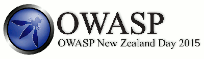

## Past Events

### 2019

#### 10 December: [Auckland Meetup](https://www.meetup.com/OWASP-New-Zealand-Chapter-Auckland/events/257141559/)
   
**Secure Coding Tournament:** Hosted by Jeanette Gill, [Secure Code Warrior](https://securecodewarrior.com/)  
**Location:** Orion Health, 181 Grafton Road, Grafton, Auckland

-------------------

#### 8 October: [Auckland Meetup](https://www.meetup.com/OWASP-New-Zealand-Chapter-Auckland/events/257141543/)
  
**Top Ten Discussion:** A6 - Security Misconfiguration  - Led by James Ting-Edwards  
**Presentation:** What's In a Name? Law of Agency and Domain Name Registrations - Judy Ting-Edwards  
**Event Sponsor and Host:** [Middleware NZ](https://www.middleware.co.nz/#/)
**Venue Host:** Simon White  
**Location:** Middleware NZ, 104 Quay Street, CBD, Auckland

-------------------

#### 24 - 25 August: Security.ac.nz Conference

  

OWASP NZ is proud to invite you to our first [security.ac.nz](https://security.ac.nz) event.
**Details are available on the [event website](https://security.ac.nz).**       
**Registration:** FREE   
**Location:** Maclaurin Lecture Theatres, Victoria University of Wellington  

-------------------

#### 13 August: [Auckland Meetup](https://www.meetup.com/OWASP-New-Zealand-Chapter-Auckland/events/257141559/)
   
**Top Ten Discussion:** A9 - Using Components with Known Vulnerabilities - Led by John DiLeo
**Technical Discussion:** Addressing Vulnerable Components with OWASP Projects and Tools - John DiLeo ([@gr4ybeard](https://twitter.com/gr4ybeard))  
**Location:** Orion Health, 181 Grafton Road, Grafton, Auckland

-------------------

#### 10 August: [Auckland Training Day](https://www.meetup.com/OWASP-New-Zealand-Chapter-Auckland/events/262858250/)
   
**Threat Modelling: Getting from None to Done** - John DiLeo ([@gr4ybeard](https://twitter.com/gr4ybeard))   
**Registration:** $125.00 (plus EventBrite fees), inclusive of morning and afternoon tea, lunch, and class materials  
**Location:** Orion Health, 181 Grafton Road, Grafton, Auckland  

-------------------

#### 11 June: [Auckland Meetup](https://www.meetup.com/OWASP-New-Zealand-Chapter-Auckland/events/257141477/)   
**Top Ten Discussion:** A5 - Broken Access Control - Led by John DiLeo  
**Presentation:** My Recent Adventures at OWASP Conferences - John DiLeo ([@gr4ybeard](https://twitter.com/gr4ybeard))  
**Event Sponsor and Host:** [Robert Walters](https://www.robertwalters.co.nz/)
**Location:** Robert Walters, Level 9, 22 Fanshawe Street, CBD, Auckland

-------------------

#### 9 April: [Auckland Meetup](https://www.meetup.com/OWASP-New-Zealand-Chapter-Auckland/events/257141431/)
   
**Top Ten Discussion:** A4 - XML External Entities (XXE) - Led by John DiLeo ([@gr4ybeard](https://twitter.com/gr4ybeard))  
**Open Discussion:** What do we want to do this year?  
**Location:** Orion Health, 181 Grafton Road, Grafton, Auckland

-------------------

#### 21 - 22 February: Tenth OWASP New Zealand Day Conference

**[OWASP New Zealand Day 2019](https://wiki.owasp.org/index.php/OWASP_New_Zealand_Day_2019)** - University of Auckland Business School  
* One-day conference, with two tracks, on Friday, 22 February - Conference Registration: FREE  
* Pre-Conference Training, Thursday, 21 February - Three classes offered    
Registration fees: $250.00 for half-day classes; $500.00 for full-day classes

-------------------

### 2018

#### 11 December: [Auckland Meetup](https://www.meetup.com/OWASP-New-Zealand-Chapter-Auckland/events/249448666/)
   
**Top Ten Discussion:** A2 - Broken Authentication - Led by John DiLeo  
**Technical Topic:** Some Thoughts on Threat Modelling - John DiLeo ([@gr4ybeard](https://twitter.com/gr4ybeard))  
**Location:** Orion Health, 181 Grafton Road, Grafton, Auckland  

-------------------

#### 29 October: [Wellington Meetup](https://www.meetup.com/OWASP-Wellington/events/255158934/)
   
**Presentation:** Make the Cyber Safer with Multi-factor Authentication - Kevin Thomas  
**Video:** [https://www.youtube.com/watch?v=lAkw24tClvQ](https://www.youtube.com/watch?v=lAkw24tClvQ)    

-------------------

#### 9 October: [Auckland Meetup](https://www.meetup.com/OWASP-New-Zealand-Chapter-Auckland/events/255158934/)
   
**Technical Topic:** Integrating the Weakforced Security API - Steve Shipway, SMX Email  
**Event Sponsor and Host:** [Cornerstone On-Demand](https://www.cornerstoneondemand.com/)  
**Location:** Cornerstone On-Demand, Level 1, 29 Union Street, Auckland

-------------------

#### 27 August: [Wellington Meetup](https://www.meetup.com/OWASP-Wellington/events/253077472/)
   
**Presentation:** Developer's guide to Deserialization Attack - Felix Shi  
**Video:** [https://www.youtube.com/watch?v=Gi-Pk255Jyw](https://www.youtube.com/watch?v=Gi-Pk255Jyw)  

-------------------

#### 14 August: [Auckland Meetup](https://www.meetup.com/OWASP-New-Zealand-Chapter-Auckland/events/249448651/)
      
**Top Ten Discussion:** A3 - Sensitive Data Exposure - Led by John DiLeo ([@gr4ybeard](https://twitter.com/gr4ybeard))  
**Presentation:** Web Application Penetration Testing Demo - Shofe Miraz ([@shmi012](https://twitter.com/shmi012))    
**Location:** Orion Health, 181 Grafton Road, Grafton, Auckland

-------------------

#### 12 June: [Auckland Meetup](https://www.meetup.com/OWASP-New-Zealand-Chapter-Auckland/events/mcvvmpyxgbnb/)
    
**Presentation:** GDPR and New Zealand Privacy Law - James Ting-Edwards ([@nullary](https://twitter.com/nullary))  
**Event Sponsor and Host:** [InternetNZ](https://internetnz.nz/)  
**Location:** InternetNZ, 62 Victoria Street West, Auckland CBD, Auckland

-------------------

#### 11 June: [Wellington Meetup](https://www.meetup.com/OWASP-Wellington/events/250629813/)
   
**Presentation:** What are certificates? - Matt Cotterell ([@mattcotterellnz](https://twitter.com/mattcotterellnz)   

-------------------

#### 10 April: [Auckland Meetup](https://www.meetup.com/OWASP-New-Zealand-Chapter-Auckland/events/mcvvmpyxgbnb/)
   
**Top Ten Discussion:** A1 - Injection - Led by John DiLeo  
**Presentation:** OWASP Software Assurance Maturity Model (SAMM) - John DiLeo ([@gr4ybeard](https://twitter.com/gr4ybeard))  
**Location:** Orion Health, 181 Grafton Road, Grafton, Auckland

-------------------

#### 28 March: [Christchurch Meetup](https://www.meetup.com/OWASP-New-Zealand-Chapter-Christchurch/events/241803609/)
     
**Presentation:** CERT NZ  
**Event Sponsor:** [Catalyst](http://www.catalyst.net.nz/)

-------------------

#### 26 February: [Wellington Meetup](https://www.meetup.com/OWASP-Wellington/events/246852662/)
     
**Presentation:** CERT NZ - Who are we? How are websites getting hacked in real life? - Declan Ingram  
**Video:** [https://www.youtube.com/watch?v=WhYh-eUqxIA](https://www.youtube.com/watch?v=WhYh-eUqxIA)  

-------------------

#### 4 - 5 February: Ninth OWASP New Zealand Day Conference

[OWASP New Zealand Day 2018](https://wiki.owasp.org/index.php/OWASP_New_Zealand_Day_2018) - University of Auckland Business School  
* One-day conference, with two tracks, on Monday, 5 February - FREE Registration
* Pre-Conference Training, Sunday, 3 February - One class offered  
Registration fee: $500.00

-------------------

### 2017

#### 2 October: [Wellington Meetup](https://www.meetup.com/OWASP-Wellington/events/242968218/)
     
**Presentation:** Same-origin policy: The core of web security - Kirk Jackson  
**Video:** [https://www.youtube.com/watch?v=5wFCRANIbdc](https://www.youtube.com/watch?v=5wFCRANIbdc)  

-------------------

#### 27 September: [Christchurch Meetup](https://www.meetup.com/OWASP-New-Zealand-Chapter-Christchurch/events/241328587/)
     
**Presentation:** Securing your data (your business) using SQL Server 2016 - [Anupama Natarajan](https://twitter.com/shantha05)     
**Event Sponsor:** [Catalyst](http://www.catalyst.net.nz/)

-------------------

#### 31 July: [Wellington Meetup](https://www.meetup.com/OWASP-New-Zealand-Chapter-Wellington/events/241187473/)
   
**Presentation:** What is Cross-Site Request Forgery? - Vales Bakaitis  
**Video:** [https://www.youtube.com/watch?v=G1aLGaMqnm0](https://www.youtube.com/watch?v=G1aLGaMqnm0)  

-------------------

#### 28 June: [Christchurch Meetup](https://www.meetup.com/OWASP-New-Zealand-Chapter-Christchurch/events/236349292/)
   
**Web Developer Quiz Night**  
**Prepared and Conducted By:** [Kim Carter](https://twitter.com/binarymist)  
**Details [on binarymist.io](https://binarymist.io/talk/owaspnz-chch-meetup-2017-workshop-quiz-night/)**   
**Event Sponsor:** [Catalyst](http://www.catalyst.net.nz/)

-------------------

#### 29 May: [Wellington Meetup](https://www.meetup.com/OWASP-New-Zealand-Chapter-Wellington/events/239202702/)
   
**Presentation:** Developer's Guide to Preventing XSS - Felix Shi    
**Video:** [https://www.youtube.com/watch?v=0J5Rpf3nNjU](https://www.youtube.com/watch?v=0J5Rpf3nNjU)  

-------------------

#### 19 - 20 April: Eighth OWASP New Zealand Day Conference

[OWASP New Zealand Day 2017](https://wiki.owasp.org/index.php/OWASP_New_Zealand_Day_2017) - University of Auckland Business School  
* One-day conference, with two tracks, on Thursday, 20 April - FREE Registration
* Pre-Conference Training, Wednesday, 19 April - Half-day and full-day classes offered

-------------------

#### 29 March: [Christchurch Meetup](https://www.meetup.com/OWASP-New-Zealand-Chapter-Christchurch/events/236349292/)
   
**Presentation:** PHP Hurts Programmers (and other tales) - Keith Humm ([@spronkey](https://twitter.com/spronkey))    
**Slides:** [On Speaker Deck](https://speakerdeck.com/spronkey/php-hurts-programmers-and-other-tales)   
**Event Sponsor:** [Catalyst](http://www.catalyst.net.nz/)

-------------------

#### 27 February: [Wellington Meetup](https://www.meetup.com/OWASP-New-Zealand-Chapter-Wellington/events/237712167/)
     
**Presentation:** Building the ultimate login and signup - Matt Cotterell   
**Video:** [https://www.youtube.com/watch?v=E25KxLKwY-M](https://www.youtube.com/watch?v=E25KxLKwY-M)  
**Location:** Wellington

-------------------

### 2016

#### 29 November: [Wellington Meetup](https://www.meetup.com/OWASP-New-Zealand-Chapter-Wellington/events/233253214/)
  
**Presentation:** OWASP Top Ten - Developing Secure Web Apps (PHP-Flavoured) - Kirk Jackson  
**Video:** [https://www.youtube.com/watch?v=7u08zCz9viU](https://www.youtube.com/watch?v=7u08zCz9viU)    
**Event Co-Hosts:** [PHP UserGroup Wellington](https://www.meetup.com/PHP-Usergroup-Wellington/)  

-------------------

#### 10 October: [Wellington Meetup](https://www.meetup.com/OWASP-New-Zealand-Chapter-Wellington/events/233954065/)
   
**Presentation:** Introduction to Ruby on Rails security - Tim Goddard  
**Video:** [https://www.youtube.com/watch?v=Hez1QYc9yo8](https://www.youtube.com/watch?v=Hez1QYc9yo8)  
**Event Sponsor:** [Insomnia Security Specialists](https://www.insomniasec.com)  

-------------------

#### 28 September: [Christchurch Meetup](https://www.meetup.com/OWASP-New-Zealand-Chapter-Christchurch/events/232611291/)
  
**Presentation and Demo:** Applying Cold War Learnings to our Daily OPSEC - Chris Campbell ([@phage_nz](https://twitter.com/phage_nz))
**DeadDrop:** [https://deaddrop.jadeworld.com/](https://deaddrop.jadeworld.com/)  
**Github Repo:** [https://github.com/phage-nz/deaddrop](https://github.com/phage-nz/deaddrop)  
**Event Sponsors:** [Catalyst](http://www.catalyst.net.nz/) and [BinaryMist](https://binarymist.io/)  

-------------------

#### 29 August: [Wellington Meetup](https://www.meetup.com/OWASP-New-Zealand-Chapter-Wellington/events/232212284/)
  
**Presentation:** Mobile App Security: Introduction to the OWASP Mobile Top 10 - Mike Haworth  
**Video:** [https://www.youtube.com/watch?v=SbXO6wNvOM4](https://www.youtube.com/watch?v=SbXO6wNvOM4)  

-------------------

#### 29 June: [Christchurch Meetup](http://www.meetup.com/OWASP-New-Zealand-Chapter-Christchurch/events/229985413/)
  
**Presentation and Demo:** Security Regression Testing with ZapAPI and NodeGoat - Kim Carter ([@binarymist](https://twitter.com/binarymist))  
**Teaser Video:** [https://youtu.be/DrwXUOJWMoo](https://youtu.be/DrwXUOJWMoo)  
**Github Repo:** [https://github.com/binarymist/NodeGoat/wiki/Security-Regression-Testing-with-Zap-API](https://github.com/binarymist/NodeGoat/wiki/Security-Regression-Testing-with-Zap-API)  
**Source Material:** Kim's Book, *[Holistic InfoSec for Web Developers](https://leanpub.com/holistic-infosec-for-web-developers/read#process-agile-development-and-practices-security-regression-testing)*  
**Event Sponsors:** [Catalyst](http://www.catalyst.net.nz/ and [BinaryMist](https://binarymist.io/)   

-------------------

#### 27 June: [Wellington Meetup](http://www.meetup.com/OWASP-New-Zealand-Chapter-Wellington/events/232017285/)
  
**Presentation:** Introduction to Using a Web Application Firewall (WAF) - Graeme Neilson
**Video:** [https://www.youtube.com/watch?v=iAPFf9Iqwos](https://www.youtube.com/watch?v=iAPFf9Iqwos)  
**Event Sponsor:** [RedShield](https://www.redshield.co)  

-------------------

#### 30 March: [Christchurch Meetup](http://www.meetup.com/OWASP-New-Zealand-Chapter-Christchurch/events/226227782/)
    
**Presentation:** Discussion of [Qubes OS](https://www.qubes-os.org) - Craig Rowland  
**Event Sponsors:** [Dimension Data](https://www.dimensiondata.com/en) and [BinaryMist](https://binarymist.io/)   

-------------------

#### 3-4 February: Seventh OWASP New Zealand Day Conference

 

[OWASP New Zealand Day 2016](https://wiki.owasp.org/index.php/OWASP_New_Zealand_Day_2016) - University of Auckland School of Commerce

* One-day conference, with two tracks in the afternoon, on Thursday, 4 February - FREE Registration
* Pre-Conference Training, Wednesday, 3 February - One class offered  

-------------------

### 2015

#### 25 November: [Christchurch Meetup](http://www.meetup.com/OWASP-New-Zealand-Chapter-Christchurch/events/225737100/)
    
**Presentation:** UAC, Governance, and Managing the External Infosec Audit - Drewe Hinkley  
**Event Sponsors:** [Dimension Data](https://www.dimensiondata.com/en) and [BinaryMist](https://binarymist.io/)   

-------------------

#### 30 September: [Christchurch Meetup](http://www.meetup.com/OWASP-New-Zealand-Chapter-Christchurch/events/223462991/)
  
**Presentations:**
* The Exploited and the Exploiters: Case Study of a Real Cyber Hack - Salinda Lekamge
* Live Demo's from *[Holistic InfoSec for Web Developers](https://leanpub.com/b/holisticinfosecforwebdevelopers)* - Kim Carter ([@binarymist](https://twitter.com/binarymist))  

-------------------

#### 24 June: [Christchurch Meetup](http://www.meetup.com/OWASP-New-Zealand-Chapter-Christchurch/events/221412721/)
  
**Presentation:** Does Your Cloud Solution Look Like a Mushroom? - Kim Carter ([@binarymist](https://twitter.com/binarymist))  
**Event Sponsors:** [Dimension Data](https://www.dimensiondata.com/en) and [BinaryMist](https://binarymist.io/)   

-------------------

#### 25 March: [Christchurch Meetup](http://www.meetup.com/OWASP-New-Zealand-Chapter-Christchurch/events/219456317/)
  
**Presentation:** Reverse Engineering, Cracking, Compromising Software Security & Mitigations - Rob Gilmour, Senior Software Engineer, Technical Support, [Jade Software Corporation Ltd.](https://www.jadeworld.com/)  
**Event Sponsors:** [Dimension Data](https://www.dimensiondata.com/en) and [BinaryMist](https://binarymist.io/)   

----------------

#### 26-27 February: Sixth OWASP New Zealand Day Conference

 

[OWASP New Zealand Day 2015](https://wiki.owasp.org/index.php/OWASP_New_Zealand_Day_2015) - University of Auckland Engineering Department

* One-day conference, with two tracks in the afternoon, on Friday, 27 February - FREE Registration
* Pre-Conference Training, Thursday, 26 February - One class offered

-------------------

### 2014

#### 26 November: [Christchurch Meetup](http://www.meetup.com/OWASP-New-Zealand-Chapter-Christchurch/events/209420462/)
    
**Workshop:** SSL/TLS Review, SSL Stripping Demo, and Mitigation Techniques - Kevin Alcock ([@kevinnz](https://twitter.com/kevinnz)), [Katipo Security](https://katiposec.com/)  
**Event Sponsors:** [Dimension Data](https://www.dimensiondata.com/en) and [BinaryMist](https://binarymist.io/)   

-------------------

#### 25 September: [Christchurch Meetup](http://www.meetup.com/OWASP-New-Zealand-Chapter-Christchurch/events/198512052/)
  
**Workshop:** Review, Exploit, and Learn from the Vulnerable Web App - Chris Campbell, [Jade Software Corporation Ltd.](https://www.jadeworld.com/)  
**Event Sponsors:** [Dimension Data](https://www.dimensiondata.com/en) and [BinaryMist](https://binarymist.io/)   

-------------------

#### 24 July: [Wellington Meetup](http://www.meetup.com/OWASP-New-Zealand-Chapter-Wellington/events/193784032/)
    
**Workshop:** Web App Security Workshop - Adrian Hayes
**Event Sponsor:** [Dimension Data](https://www.dimensiondata.com/en)  

-------------------

### 2013

#### 19 December: [Chapter Meetup](http://www.meetup.com/OWASP-New-Zealand-Chapter/events/154075992/)
  
**Presentation:** Extending Burp with Python ([PowerPoint Slide Deck](https://wiki.owasp.org/images/9/9f/Extending-Burp-with-Python.pptx)) - Mike Haworth, [Aura Information Security](https://www.aurainfosec.com/)  
**Locations:** Dimension Data offices in Auckland, Christchurch, and Wellington  
**Event Sponsors:** [Security-Assessment.com](http://security-assessment.com) and [Touchpoint](http://www.touchpoint.co.nz)  

------------------

#### 11-12 September: Fifth OWASP New Zealand Day Conference

 

[OWASP New Zealand Day 2013](https://wiki.owasp.org/index.php/OWASP_New_Zealand_Day_2013) - University of Auckland Business School  

* One-day conference, with two tracks in the afternoon, on Thursday, 12 September - FREE Registration
* Pre-Conference Training, Wednesday, 11 September - Two classes offered  

-------------------

#### 22 May: [Chapter Meetup](http://www.meetup.com/OWASP-New-Zealand-Chapter/events/115108982/)  

**Presentations:**
* Secure by Design - Simon Burson
* The New OWASP Top 10 - Adrian Hayes
  
**Locations:** Dimension Data offices in Auckland and Wellington  
**Event Sponsors:** [Security-Assessment.com](http://security-assessment.com) and [Touchpoint](http://www.touchpoint.co.nz)  

-------------------

### 2012

#### 30-31 August: Fourth OWASP New Zealand Day Conference

 

[OWASP New Zealand Day 2012](https://wiki.owasp.org/index.php/OWASP_New_Zealand_Day_2012) - University of Auckland Business School  

* One-day conference, with two tracks in the afternoon, on Friday, 31 August - FREE Registration
* Pre-Conference Training, Thursday, 30 August - Two classes offered  

-------------------

#### 8 May: Chapter Meetup
   
**Presentation:** An Overview and introduction to modern day BeEF ([Slides](https://wiki.owasp.org/images/e/e0/Owasp2012-MarkPiper.pdf)) - Mark Piper, Insomnia Security Specialists   
**Locations:** Auckland and Wellington   
**Event Sponsors:** [Security-Assessment.com](http://security-assessment.com) and [Touchpoint](http://www.touchpoint.co.nz)  

-------------------

#### 28 February: Chapter Meetup
   
**Presentations:**   
* Introduction to the OWASP Top Ten - Part 3 ([Slides](https://wiki.owasp.org/images/2/27/OWASP_Top_10-7_to_10-aj.pdf)) - Adrian Hayes, Security-Assessment.com    
* Mistaken Identity: How Not To Build A Password Reset Process ([Slides]([https://wiki.owasp.org/images/0/08/OWASP-Mistaken_Identity-Password_Reset-nickf.pdf)) - Nick Freeman, Security-Assessment.com   

**Locations:** Auckland and Wellington   
**Event Sponsors:** [Security-Assessment.com](http://security-assessment.com) and [Touchpoint](http://www.touchpoint.co.nz)  

-------------------

### 2011

#### 6 December: Chapter Meetup
   
**Presentations:**    
* Introduction to the OWASP Top Ten - Part 2 ([Slides](https://wiki.owasp.org/images/6/6d/OWASP_NZ-DEC2011-OWASP_Top_10-4_to_6.pdf)) - Adrian Hayes, Security-Assessment.com  
* Hardened Hosting ([Slides](https://wiki.owasp.org/images/1/15/OWASP_NZ-DEC2011-Hardened_Hosting.pdf)) - Quintin Russ, SiteHost  

**Locations:** Auckland and Wellington   
**Event Sponsors:** [Security-Assessment.com](http://security-assessment.com) and [Touchpoint](http://www.touchpoint.co.nz)  

-------------------

#### 20 September: Chapter Meetup
   
**Presentations:**   
* Introduction to the OWASP Top Ten - Part 1 ([Slides](https://wiki.owasp.org/images/c/cf/OWASP_NZ_SEP2011_TOP-10_1-of-3.pdf)) - Nick Freeman, Security-Assessment.com   
* Clickjacking for Shells ([Slides](https://wiki.owasp.org/images/3/31/OWASP_NZ_SEP2011_Clickjacking-for-shells_PDF-version.pdf)) - Andrew Horton, Security-Assessment.com   

**Locations:** Auckland and Wellington   
**Event Sponsor:** [Security-Assessment.com](http://security-assessment.com)  

-------------------

#### 7 July: Third OWASP New Zealand Day Conference

 

[OWASP New Zealand Day 2011](https://wiki.owasp.org/index.php/OWASP_New_Zealand_Day_2011) - University of Auckland Business School  

* One-day, single-track conference on Thursday, 7 July - FREE Registration
* Concurrent Training on Thursday - Two classes offered  

-------------------

#### 2 March: Chapter Meetup
   
**Presentations:**   
* Crazy Insecure Web Apps Google Didn't Tell You About - Adrian Hayes, Security-Assessment.com   
* I know what you did last summer: The latest from the world of web hacks ([Slides](http://wiki.owasp.org/images/5/5e/2011-03-02-OWASP.pdf)) - Kirk Jackson, Aura Software Security   

**Locations:** Auckland and Wellington   
**Event Sponsor:** [Security-Assessment.com](http://security-assessment.com)  

-------------------

### 2010

#### 15 July: Second OWASP New Zealand Day Conference

 

[OWASP New Zealand Day 2010](https://wiki.owasp.org/index.php/OWASP_New_Zealand_Day_2010) - University of Auckland Business School  

* One-day, single-track conference - FREE Registration

-------------------

#### 4 March: Chapter Meetup

**Presentation:** MS-SQL Injections - Scott Bell, Security-Assessment.com
**Locations:** Auckland and Wellington   
**Event Sponsor:** [Security-Assessment.com](http://security-assessment.com)  

-------------------

### 2009

#### 10 November: Chapter Meetup

**Presentations:**    
* Testing AMF/Flex - Nick Freeman, Security-Assessment.com
* "Shared Ownership," from a web security perspective - Quintin Russ, Site Host

**Locations:** Auckland and Wellington   
**Event Sponsor:** [Security-Assessment.com](http://security-assessment.com)  

-------------------

#### 13 July: OWASP New Zealand Day

 

[OWASP New Zealand Day 2009](https://wiki.owasp.org/index.php/OWASP_New_Zealand_Day_2009) - University of Auckland  

* One-day, single-track conference - FREE Registration

-------------------

#### 19 March: Chapter Meetup

**Presentations:**   
* ActiveXploitation in 2009 ([Slides](http://wiki.owasp.org/index.php/Image:ActiveXploitation_In_2009.pptx)) - Paul Craig, Security-Assessment.com
* Reversing JavaScript ([Slides](http://wiki.owasp.org/index.php/Image:OWASP_Mar09_Reversing_JavaScript.zip)) - Roberto Suggi Liverani, Security-Assessment.com
   
**Locations:** Auckland and Wellington   
**Event Sponsors:** [Vodafone New Zealand](http://www.vodafone.co.nz) and [Security-Assessment.com](http://security-assessment.com)  

-------------------

### 2008

#### 5 November: Chapter Meetup
 
**Presentations:**   
* Common Application Flaws ([Slides](https://wiki.owasp.org/index.php/Image:Common_Application_Flaws.ppt)) - Brett Moore, Insomnia Security   
* In your Browser, Jackin your Clicks - Beau Butler, Security-Assessment.com
* Opera Stored Cross Site Scripting - Roberto Suggi Liverani, Security-Assessment.com
   
**Locations:** Auckland and Wellington   
**Event Sponsors:** [Vodafone New Zealand](http://www.vodafone.co.nz) and [Security-Assessment.com](http://security-assessment.com)  

-------------------

#### 3 September: Chapter Meetup

**Presentations:** 
* Browser Security ([Slides](https://wiki.owasp.org/index.php/Image:Browser_security.ppt Browser Security)) - Roberto Suggi Liverani, Security-Assessment.com
* Time-Based Blind SQL Injections ([Slides](https://wiki.owasp.org/index.php/Image:Time_Based_SQL_Injections.ppt)) - Muhaimin Dzulfakar, Security-Assessment.com

**Locations:** Auckland and Wellington   
**Event Sponsors:** [Microsoft](http://www.microsoft.com/en/nz/default.aspx) and [Security-Assessment.com](http://security-assessment.com)  

-------------------

#### 25 June: Chapter Meetup

**Presentations:**   
* Fuzz the Web - Dean Jerkovich, ASB
* Hacking The World With Flash Part #2: The Results - Paul Crag, Security-Assessment.com

**Locations:** Auckland and Wellington   
**Event Sponsor:** [Security-Assessment.com](http://security-assessment.com)  

-------------------

#### 29 April: Chapter Meetup

**Presentations:**   
* Hacking The World With Flash ([Slides](https://wiki.owasp.org/index.php/Image:Hacking_The_World_With_Flash.ppt)) - Paul Craig, Security-Assessment.com  
* Web Spam Techniques ([Slides](https://wiki.owasp.org/index.php/Image:Web_spam_techniques.ppt)) - Roberto Suggi Liverani, Security-Assessment.com

**Locations:** Auckland and Wellington   
**Event Sponsor:** [Security-Assessment.com](http://security-assessment.com)  

-------------------

#### 21 February: Auckland Meetup

**Presentation:** Xpath Injection - An Overview ([Slides](http://wiki.owasp.org/index.php/Image:Xpath_Injection.ppt)) - Roberto Suggi Liverani, Security-assessment.com   
**Event Sponsor:** Veda Advantage   

-------------------

### 2007

#### 5 December: Aucland Meetup

**Presentations:** 

* Ajax Security ([Slides](http://malerisch.net/docs/ajax_security/Ajax_security.ppt Ajax Security)) - Roberto Suggi Liverani, Security-assessment.com
* On-the-job Browser Exploitation - Mark Piper, Security-assessment.com   

**Event Sponsor:** Veda Advantage   

-------------------

#### 22 May: Auckland Meetup

**Presentation:** OWASP in New Zealand - Roberto Suggi Liverani and Antonio Spera
**Event Sponsor:** Veda Advantage      

**January and April**

Events held in Auckland, sponsored by Veda Advantage (Acquired by Equifax in February 2016)   
